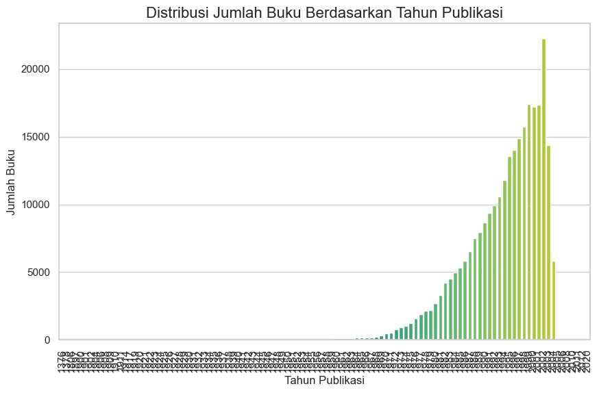
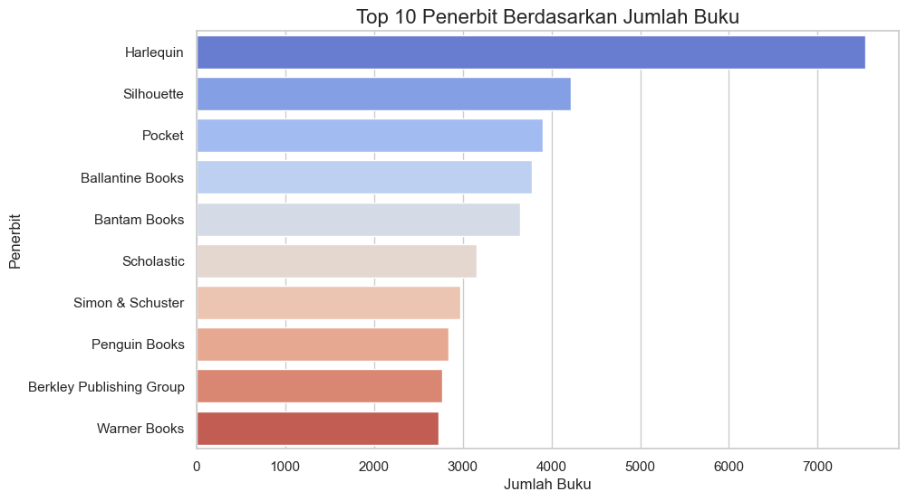
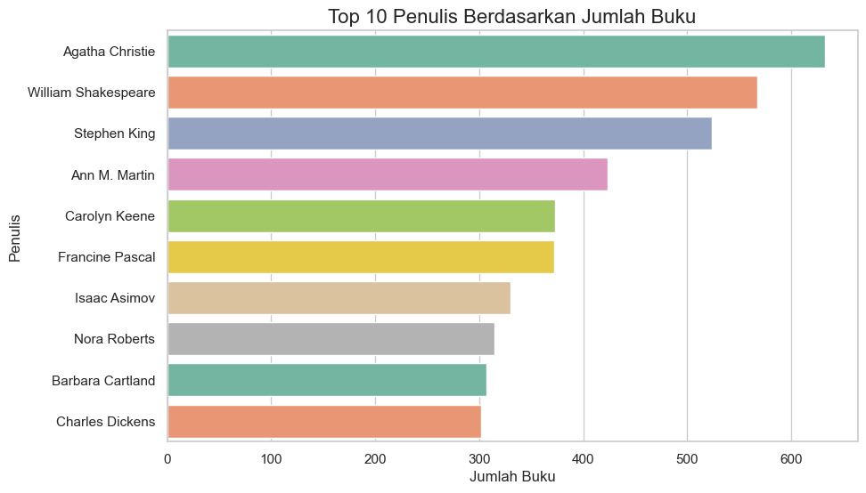
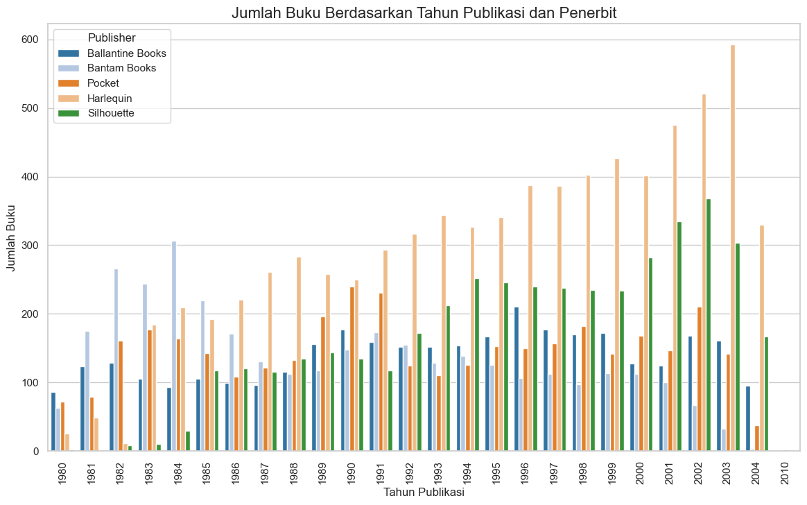
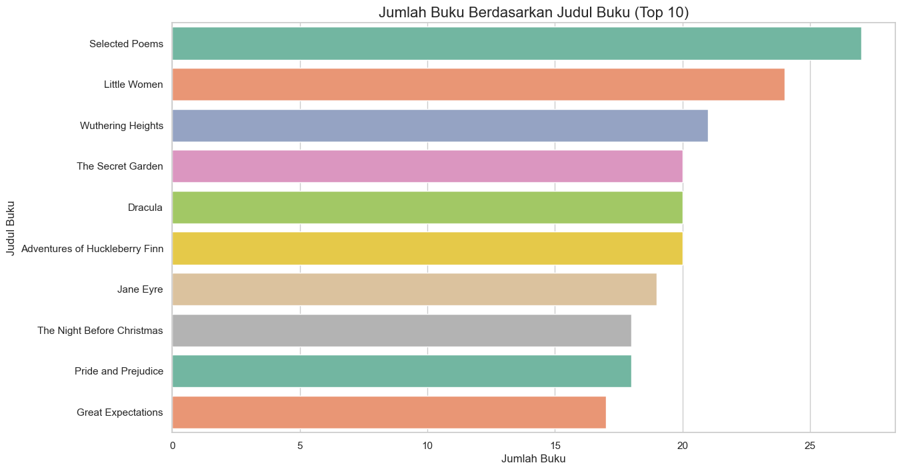
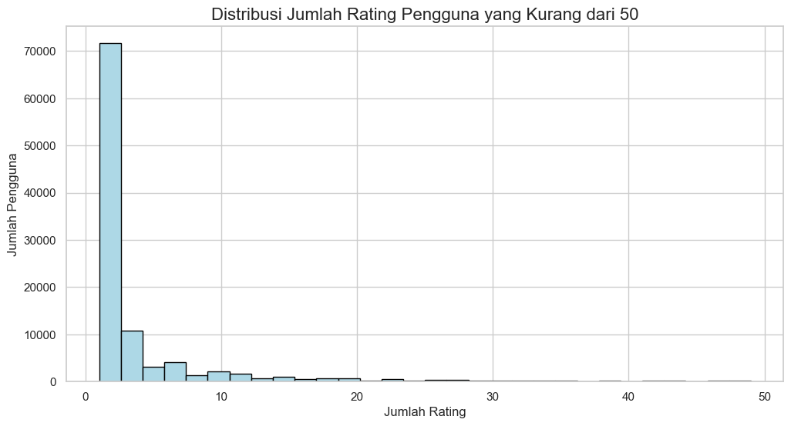
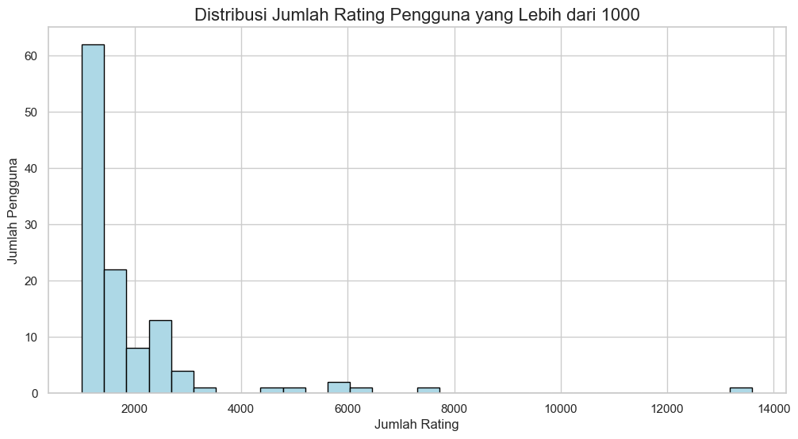
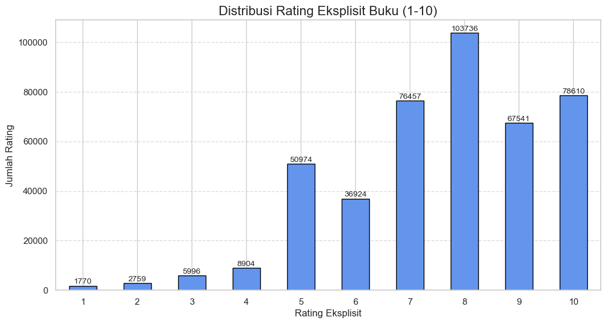
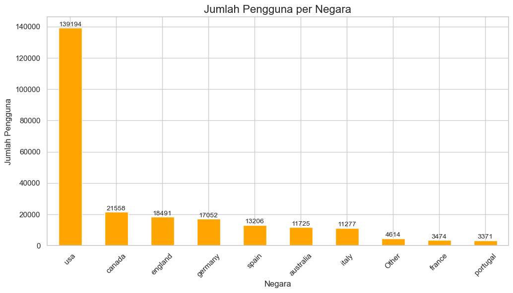
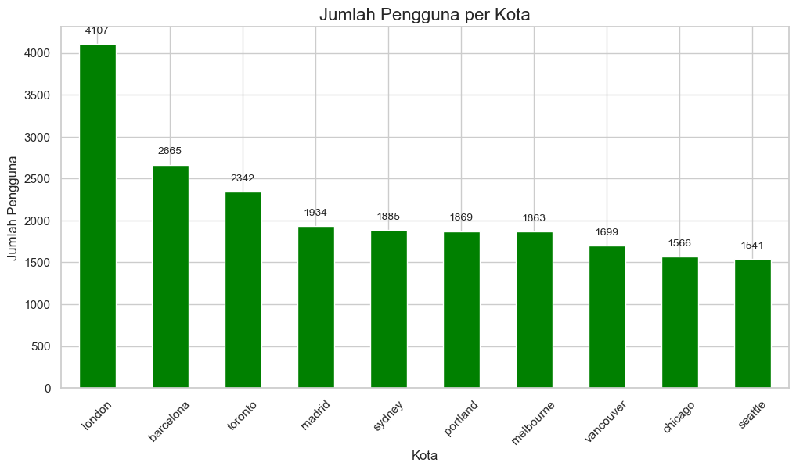

# Laporan Proyek Machine Learning - Ziyad Muhammad Adzin Azzufari

## Project Overview

Dalam era digital saat ini, sistem rekomendasi telah menjadi komponen penting dalam membantu pengguna menemukan konten yang relevan dan menarik di berbagai platform. Berbagai sistem rekomendasi diterapkan di industri yang berbeda, mulai dari e-commerce hingga platform streaming. Tujuan utama dari proyek ini adalah untuk mengembangkan sistem rekomendasi buku menggunakan beberapa teknik pembelajaran mesin, dengan pendekatan yang berbeda untuk memberikan rekomendasi yang lebih personal dan relevan kepada pengguna. 

Proyek ini melibatkan pengembangan empat pendekatan utama:

1. **Popularity Based Recommender System**  
   Sistem ini memberikan rekomendasi berdasarkan popularitas buku di kalangan pengguna, dengan mempertimbangkan jumlah rating dan rating rata-rata sebagai indikator popularitas buku.

2. **Collaborative Filtering (Item-Based Filtering)**  
   Sistem ini memanfaatkan informasi dari pengguna lain yang memiliki preferensi serupa, untuk memberikan rekomendasi buku berdasarkan kesamaan item yang telah dinikmati oleh pengguna sebelumnya.

3. **Content-Based Filtering Berdasarkan Popularitas Judul Buku**  
   Pendekatan ini merekomendasikan buku berdasarkan kesamaan judul atau konten buku, dengan menggunakan teknik TF-IDF untuk menghitung kemiripan antar buku berdasarkan kata-kata kunci dalam judul buku.

4. **Content-Based Filtering Berdasarkan Rata-rata Rating Buku**  
   Pendekatan ini menggabungkan kesamaan buku berdasarkan konten dengan mempertimbangkan rating yang diberikan oleh pengguna, sehingga memberikan rekomendasi yang tidak hanya relevan dari segi isi buku tetapi juga berdasarkan kualitas atau rating buku tersebut.

Keempat pendekatan ini bertujuan untuk memberikan rekomendasi buku yang lebih baik dan lebih personal dengan memanfaatkan berbagai faktor, termasuk popularitas, kesamaan konten, dan rating pengguna.

## Business Understanding

### Problem Statements

Dalam proyek ini, terdapat beberapa pertanyaan utama yang ingin dijawab terkait sistem rekomendasi buku:

1. **Bagaimana cara merekomendasikan buku yang populer kepada pengguna berdasarkan jumlah rating dan rating rata-rata?**
   - Fokus pada pemilihan buku dengan rating tertinggi dan jumlah rating yang cukup untuk memastikan kualitas rekomendasi.
   
2. **Bagaimana membuat sistem rekomendasi berbasis Collaborative Filtering (Item-Based Filtering) yang memanfaatkan kesamaan antar buku?**
   - Menyusun model yang bisa memberikan rekomendasi berdasarkan rating pengguna dan kesamaan antar buku.
   
3. **Bagaimana menggunakan teknik Content-Based Filtering untuk merekomendasikan buku berdasarkan judul dan popularitasnya?**
   - Memanfaatkan fitur seperti judul buku, TF-IDF, dan kesamaan konten antar buku untuk memberikan rekomendasi.

4. **Bagaimana meningkatkan kualitas rekomendasi dengan mempertimbangkan rata-rata rating dan kesamaan konten?**
   - Menggabungkan informasi rating dan kesamaan konten untuk membuat rekomendasi yang lebih relevan.

### Goals

Tujuan utama dari proyek ini adalah untuk mengembangkan sistem rekomendasi buku yang dapat:

1. **Menghasilkan rekomendasi buku berdasarkan popularitas** dengan menggunakan rating dan jumlah rating.
   - Fokus pada buku yang mendapatkan banyak perhatian dan feedback dari pengguna.
   
2. **Menerapkan Collaborative Filtering untuk memberikan rekomendasi buku yang relevan** berdasarkan kesamaan buku yang telah dinilai oleh pengguna lain.

3. **Mengembangkan Content-Based Filtering dengan mempertimbangkan popularitas judul dan konten buku** seperti rating dan kesamaan teks.
   - Rekomendasi buku yang lebih personalisasi berdasarkan karakteristik buku yang relevan.

4. **Meningkatkan kualitas rekomendasi** dengan memanfaatkan kombinasi dari rating, jumlah rating, dan kesamaan konten untuk menghasilkan rekomendasi yang lebih baik.

### Solution Approach

Untuk mencapai tujuan tersebut, pendekatan berikut diusulkan:

1. **Popularity Based Recommender System**
   - Menganalisis buku yang memiliki jumlah rating lebih dari threshold tertentu dan memiliki rating rata-rata tinggi untuk memberikan rekomendasi buku yang populer.

2. **Collaborative Filtering (Item-Based Filtering)**
   - Menggunakan cosine similarity untuk mencari kesamaan antar buku berdasarkan rating yang diberikan oleh pengguna.
   - Menghasilkan rekomendasi buku berdasarkan buku yang serupa dengan buku yang telah dipilih atau dinilai oleh pengguna.

3. **Content-Based Filtering Berdasarkan Popularitas Judul Buku**
   - Menggunakan TF-IDF untuk menghitung kesamaan antar buku berdasarkan judul dan kata kunci dari buku tersebut.
   - Memberikan rekomendasi berdasarkan kemiripan judul buku yang telah diberi rating.

4. **Content-Based Filtering Berdasarkan Rata-rata Rating Buku**
   - Memilih buku yang memiliki rating rata-rata tinggi dan memberikan rekomendasi berdasarkan kesamaan judul buku tersebut menggunakan TF-IDF dan cosine similarity.

Dengan pendekatan ini, diharapkan dapat menciptakan sistem rekomendasi buku yang akurat, relevan, dan dapat meningkatkan pengalaman pengguna dalam menemukan buku-buku yang sesuai dengan preferensi mereka.

## Data Understanding

Dataset **Book-Crossing** terdiri dari tiga file utama yang menyimpan informasi terkait Users, Books, dan Ratings. Berikut adalah rincian tentang masing-masing file:

### 1. Users
File ini berisi informasi mengenai pengguna yang berinteraksi dengan buku dalam dataset. Setiap pengguna diidentifikasi dengan **User-ID** yang telah dianonimkan dan dipetakan ke dalam angka. Beberapa informasi tambahan mengenai pengguna, seperti **Lokasi** dan **Usia**, juga disediakan, namun kolom ini bisa saja berisi nilai **NULL** jika data tidak tersedia.

**Kolom dataset:**
- **User-ID**: ID unik yang mewakili pengguna (dianonimkan).
- **Lokasi**: Lokasi geografis pengguna, jika tersedia.
- **Usia**: Usia pengguna, jika tersedia.

### 2. Books
File ini mengandung informasi tentang buku-buku yang ada dalam dataset. Setiap buku diidentifikasi menggunakan **ISBN** (International Standard Book Number), dan buku yang memiliki ISBN tidak valid telah dihapus dari dataset.

Selain ISBN, informasi berbasis konten buku juga tersedia, seperti **Book-Title**, **Book-Author**, **Year-Of-Publication**, dan **Publisher**. Data ini diperoleh dari **Amazon Web Services**. Jika sebuah buku memiliki lebih dari satu penulis, hanya penulis pertama yang akan dicantumkan.

**Kolom dataset:**
- **ISBN**: Nomor ISBN unik yang mengidentifikasi buku.
- **Book-Title**: Judul buku.
- **Book-Author**: Nama penulis buku (hanya penulis pertama jika lebih dari satu).
- **Year-Of-Publication**: Tahun publikasi buku.
- **Publisher**: Penerbit buku.
- **Image-URL-S**: URL gambar sampul buku dalam ukuran kecil.
- **Image-URL-M**: URL gambar sampul buku dalam ukuran sedang.
- **Image-URL-L**: URL gambar sampul buku dalam ukuran besar.

### 3. Ratings
File ini berisi data penilaian yang diberikan oleh pengguna terhadap buku-buku. Penilaian dilakukan pada skala 1 hingga 10, dengan nilai yang lebih tinggi menunjukkan apresiasi yang lebih besar terhadap buku tersebut. Selain itu, ada juga nilai **0** yang menandakan penilaian implisit, di mana pengguna tidak memberikan rating eksplisit terhadap buku.

**Kolom dataset:**
- **User-ID**: ID pengguna yang memberikan rating.
- **ISBN**: ISBN buku yang diberi rating.
- **Book-Rating**: Rating yang diberikan oleh pengguna terhadap buku. Nilai ini berada dalam rentang 1-10 (rating eksplisit) atau 0 (rating implisit).

## Data Preparation

### 1. Books Dataset

#### Overview
Dataset ini terdiri dari 8 kolom dan 271360 baris. Proses data preparation dilakukan untuk memastikan dataset **Books** bersih, konsisten, dan siap digunakan untuk analisis atau pengembangan model rekomendasi. Berikut adalah langkah-langkah yang dilakukan untuk memproses data:

---

#### 1. Drop URL Columns
Dataset **Books** memiliki tiga kolom yang berisi URL gambar sampul buku dalam berbagai ukuran (**Image-URL-S**, **Image-URL-M**, dan **Image-URL-L**). Karena kolom ini tidak relevan untuk analisis, kami menghapusnya:

```python
books.drop(['Image-URL-S', 'Image-URL-M', 'Image-URL-L'], axis=1, inplace=True)
```

---

#### 2. Handle Missing Values
##### a. Cek Nilai Kosong
Melakukan pengecekan untuk mengetahui jumlah nilai kosong (NaN) di setiap kolom:

```python
books.isnull().sum()
```

**Output:**
```
ISBN                   0
Book-Title             0
Book-Author            2
Year-Of-Publication    0
Publisher              2
```

##### b. Mengisi Nilai Kosong
- Nilai kosong pada kolom **Book-Author** dan **Publisher** diisi dengan string **'Other'** untuk menjaga konsistensi data.

```python
books['Book-Author'] = books['Book-Author'].fillna('Other')
books['Publisher'] = books['Publisher'].fillna('Other')
```

---

#### 3. Perbaikan Kolom `Year-Of-Publication`
##### a. Identifikasi Masalah
Kolom **Year-Of-Publication** memiliki tipe data **object** dan terdapat beberapa masalah, seperti:
- Nilai **0** (yang tidak valid untuk tahun).
- Nama seperti "Gallimard" dan "DK Publishing Inc" yang salah dimasukkan ke kolom ini.

##### b. Perbaikan Spesifik
Melakukan perbaikan pada baris yang diketahui memiliki masalah data:

```python
# ISBN: '078946697X'
books.loc[books['ISBN'] == '078946697X', 'Publisher'] = 'DK Publishing Inc'
books.loc[books['ISBN'] == '078946697X', 'Book-Author'] = 'Michael Teitelbaum'
books.loc[books['ISBN'] == '078946697X', 'Year-Of-Publication'] = 2000
books.loc[books['ISBN'] == '078946697X', 'Book-Title'] = 'DK Readers: Creating the X-Men, How It All Began (Level 4: Proficient Readers)'

# ISBN: '0789466953'
books.loc[books['ISBN'] == '0789466953', 'Publisher'] = 'DK Publishing Inc'
books.loc[books['ISBN'] == '0789466953', 'Book-Author'] = 'James Buckley'
books.loc[books['ISBN'] == '0789466953', 'Year-Of-Publication'] = 2000
books.loc[books['ISBN'] == '0789466953', 'Book-Title'] = 'DK Readers: Creating the X-Men, How Comic Books Come to Life (Level 4: Proficient Readers)'

# ISBN: '2070426769'
books.loc[books['ISBN'] == '2070426769', 'Publisher'] = 'Gallimard'
books.loc[books['ISBN'] == '2070426769', 'Book-Author'] = 'Jean-Marie Gustave Le Clézio'
books.loc[books['ISBN'] == '2070426769', 'Year-Of-Publication'] = 2003
books.loc[books['ISBN'] == '2070426769', 'Book-Title'] = 'Peuple du ciel - Suivi de Les bergers'
```
##### c. Mengubah Tipe Data Kolom Tahun Menjadi Integer

```python
books['Year-Of-Publication'] = books['Year-Of-Publication'].astype(int)
print(sorted(books['Year-Of-Publication'].unique()))
```

**Output:**
```
[0, 1376, 1378, 1806, 1897, 1900, 1901, 1902, 1904, 1906, 1908, 1909, 1910, 1911, 1914, 1917, 1919, 1920, 1921, 1922, 1923, 1924, 1925, 1926, 1927, 1928, 1929, 1930, 1931, 1932, 1933, 1934, 1935, 1936, 1937, 1938, 1939, 1940, 1941, 1942, 1943, 1944, 1945, 1946, 1947, 1948, 1949, 1950, 1951, 1952, 1953, 1954, 1955, 1956, 1957, 1958, 1959, 1960, 1961, 1962, 1963, 1964, 1965, 1966, 1967, 1968, 1969, 1970, 1971, 1972, 1973, 1974, 1975, 1976, 1977, 1978, 1979, 1980, 1981, 1982, 1983, 1984, 1985, 1986, 1987, 1988, 1989, 1990, 1991, 1992, 1993, 1994, 1995, 1996, 1997, 1998, 1999, 2000, 2001, 2002, 2003, 2004, 2005, 2006, 2008, 2010, 2011, 2012, 2020, 2021, 2024, 2026, 2030, 2037, 2038, 2050]
```

##### d. Normalisasi Tahun
Melakukan analisis untuk jumlah publikasi yang memiliki:
- **Year-Of-Publication** lebih dari 2020.
- **Year-Of-Publication** sama dengan 0.

```python
above_2020 = books[books['Year-Of-Publication'] > 2020]
count_above_2020 = above_2020.shape[0]

equal_to_0 = books[books['Year-Of-Publication'] == 0]
count_equal_to_0 = equal_to_0.shape[0]

total_count = books.shape[0]

print(f"Jumlah publikasi dengan Year-Of-Publication > 2020: {count_above_2020}")
print(f"Jumlah publikasi dengan Year-Of-Publication = 0: {count_equal_to_0}")
print(f"Total publikasi: {total_count}")
```

**Output:**
```
Jumlah publikasi dengan Year-Of-Publication > 2020: 14
Jumlah publikasi dengan Year-Of-Publication = 0: 4618
Total publikasi: 271360
```

##### e. Normalisasi Nilai Tidak Valid
Mengganti nilai **Year-Of-Publication** yang lebih dari 2020 atau sama dengan 0 menjadi 2002 (tahun yang lebih masuk akal):

```python
books.loc[(books['Year-Of-Publication'] > 2020) | (books['Year-Of-Publication'] == 0), 'Year-Of-Publication'] = 2002
```

---

#### 4. Normalisasi `Publisher`
Melakukan normalisasi nilai pada kolom **Publisher** untuk mengganti karakter HTML seperti `&amp;` dengan karakter aslinya `&`:

```python
books.Publisher = books.Publisher.str.replace('&amp;', '&', regex=False)
```

---

#### Final Output
Setelah proses data preparation, dataset **Books** menjadi lebih bersih dan konsisten:
- Kolom URL gambar dihapus.
- Nilai kosong pada kolom **Book-Author** dan **Publisher** diisi dengan **'Other'**.
- Kesalahan pada kolom **Year-Of-Publication** diperbaiki, dan nilai tidak valid diganti dengan 2002. Kemudian tipe data diganti menjadi integer.
- Normalisasi karakter HTML pada kolom **Publisher** selesai dilakukan.

Dataset siap untuk analisis lebih lanjut atau pengembangan model rekomendasi.

### 2. Ratings Dataset

#### Overview
Dataset ini terdiri dari 3 kolom dan 1149780 baris. Bagian ini menjelaskan langkah-langkah dan pengamatan selama fase persiapan data untuk dataset `Ratings`.

---

##### Inspeksi Awal

###### Memeriksa Nilai Kosong
```python
ratings.isnull().sum()
```
**Output:**
```
User-ID        0
ISBN           0
Book-Rating    0
```
**Observasi:**
- Dataset tidak mengandung nilai kosong pada kolom mana pun.

###### Memeriksa Data Duplikat
```python
ratings.duplicated().sum()
```
**Output:**
```
0
```
**Observasi:**
- Tidak ditemukan data duplikat dalam dataset.

###### Informasi Dataset
```python
ratings.info()
```
**Output:**
```
<class 'pandas.core.frame.DataFrame'>
RangeIndex: 1149780 entries, 0 to 1149779
Data columns (total 3 columns):
 #   Column       Non-Null Count    Dtype 
---  ------       --------------    ----- 
 0   User-ID      1149780 non-null  int64 
 1   ISBN         1149780 non-null  object
 2   Book-Rating  1149780 non-null  int64 
dtypes: int64(2), object(1)
memory usage: 26.3+ MB
```
**Observasi:**
- Dataset memiliki 1.149.780 entri dan tiga kolom:
  - `User-ID`: Identifikasi pengguna (integer).
  - `ISBN`: Identifikasi buku (string).
  - `Book-Rating`: Penilaian yang diberikan kepada buku (integer).
- Tidak ada nilai kosong dalam dataset.

---

##### Eksplorasi Kolom `Book-Rating`

###### Nilai Unik dalam `Book-Rating`
```python
ratings['Book-Rating'].unique()
```
**Output:**
```
array([ 0,  5,  3,  6,  8,  7, 10,  9,  4,  1,  2], dtype=int64)
```
**Observasi:**
- Kolom `Book-Rating` mengandung nilai integer antara 0 hingga 10:
  - Nilai `0` biasanya menunjukkan penilaian implisit atau tidak adanya feedback eksplisit.
  - Nilai `1` hingga `10` merepresentasikan feedback eksplisit, dengan nilai lebih tinggi menunjukkan kepuasan lebih besar.

---

##### Ringkasan
1. Dataset bersih dan tidak mengandung nilai kosong maupun data duplikat.
2. Kolom `Book-Rating` memiliki rentang nilai (0-10), di mana `0` menunjukkan penilaian implisit, dan `1-10` menunjukkan penilaian eksplisit.
3. Tidak diperlukan praproses tambahan pada tahap ini, karena data sudah siap untuk analisis lebih lanjut.

---

### 3. Users Dataset

Dokumen ini menjelaskan langkah-langkah persiapan untuk membersihkan dan mentransformasi dataset `Users`, yang berisi informasi pengguna.

#### Gambaran Umum Dataset
- **Dimensi:** `(278858, 3)`
- **Kolom:** `User-ID`, `Location`, `Age`

#### Pemeriksaan Awal

##### Nilai Kosong
```python
users.isnull().sum()
```
**Output:**
```
User-ID          0
Location         0
Age         110762
```

##### Nilai Duplikat
```python
users.duplicated().sum()
```
**Output:**
```
0
```

##### Informasi Dataset
```python
users.info()
```
**Output:**
```
<class 'pandas.core.frame.DataFrame'>
RangeIndex: 278858 entries, 0 to 278857
Data columns (total 3 columns):
 #   Column    Non-Null Count   Dtype  
---  ------    --------------   -----  
 0   User-ID   278858 non-null  int64  
 1   Location  278858 non-null  object 
 2   Age       168096 non-null  float64
```

#### Langkah-Langkah Pembersihan Data

##### Penanganan Outlier dan Nilai Kosong pada Kolom `Age`

###### Nilai Unik dalam `Age`
```python
print(sorted(list(users['Age'].unique())))
```
**Output:**
```
[nan, 0.0, 1.0, 2.0, ..., 244.0]
```

Nilai kurang dari `10` dan lebih dari `80` dianggap sebagai outlier. Nilai-nilai ini digantikan dengan rata-rata dari usia valid (antara `10` dan `80`). Nilai kosong (`NaN`) juga diisi dengan rata-rata ini, dan kolom diubah menjadi tipe integer.

```python
required = users[(users['Age'] >= 10) & (users['Age'] <= 80)]
mean = round(required['Age'].mean())

users.loc[users['Age'] > 80, 'Age'] = mean
users.loc[users['Age'] < 10, 'Age'] = mean
users['Age'] = users['Age'].fillna(mean)
users['Age'] = users['Age'].astype(int)
```

**Hasil:** Kolom `Age` sudah bersih, dengan outlier dan nilai kosong digantikan.

##### Memisahkan Kolom `Location`
Kolom `Location`, yang berisi `City`, `Region`, dan `Country` dalam satu string, dipecah menjadi tiga kolom terpisah.

```python
split_location = users['Location'].str.split(',', expand=True).fillna('')
users[['City', 'Region', 'Country']] = split_location.iloc[:, :3]

# Menghapus spasi ekstra
users['City'] = users['City'].str.strip()
users['Region'] = users['Region'].str.strip()
users['Country'] = users['Country'].str.strip()

# Menghapus kolom Location asli
users.drop(columns='Location', inplace=True)
```

##### Penanganan Nilai Kosong dan Inkonsistensi pada `Country` dan `Region`

- Mengganti string kosong pada `Country` dengan `Other`.
- Mengganti `n/a` pada `Region` dengan `Other`.
- Standarisasi nama negara.

```python
import numpy as np
users['Country'].replace('', np.nan, inplace=True)
users['Country'] = users['Country'].fillna('Other')
users['Region'] = users['Region'].replace('n/a', 'Other')

users = users.replace({
    "england, united kingdom": "england",
    "united kingdom": "england",
    "united states of america": "usa",
    "l`italia": "italy"
}, regex=True)
```

##### Menghapus Karakter Khusus
Semua kolom dibersihkan untuk menghapus karakter khusus dan spasi ekstra.

```python
import re

def remove_special_characters(value):
    if isinstance(value, str):
        return re.sub(r'[^A-Za-z0-9\s]', '', value).strip()
    return value

users = users.applymap(remove_special_characters)
```

#### Dataset Akhir

- `User-ID`: Identifier unik untuk setiap pengguna.
- `Age`: Nilai usia yang telah dibersihkan (tipe integer).
- `City`: Kota tempat tinggal pengguna.
- `Region`: Wilayah tempat tinggal pengguna.
- `Country`: Negara pengguna, distandarisasi dan dibersihkan.

Contoh dataset yang telah dibersihkan:

| User-ID | Age | City         | Region      | Country        |
|---------|-----|--------------|-------------|----------------|
| 1       | 35  | nyc          | new york    | usa            |
| 2       | 18  | stockton     | california  | usa            |
| 3       | 35  | moscow       | yukon       | russia         |
| 4       | 17  | porto        | v.n.gaia    | portugal       |
| 5       | 35  | farnborough  | hants       | united kingdom |

#### Ringkasan Langkah Pembersihan
1. Mengidentifikasi dan mengganti outlier pada kolom `Age` dengan nilai rata-rata usia yang valid.
2. Menangani nilai kosong pada kolom `Age` dengan mengisi menggunakan rata-rata yang telah dihitung.
3. Memisahkan kolom `Location` menjadi `City`, `Region`, dan `Country`.
4. Membersihkan kolom `Country` dan `Region`, mengganti nilai yang tidak konsisten dan kosong.
5. Standarisasi dan penghapusan karakter khusus dari semua kolom.

Dataset kini siap untuk analisis lebih lanjut atau pemodelan.

Setelah pada setiap dataset seperti Books, Ratings, dan Users telah bersih selanjutnya dilakukan penggabungan datasets dalam satu tabel.

```python
# Joining books and user ratings into one table 
dataset = ratings.merge(books, on = 'ISBN')
dataset = dataset.merge(users, on = 'User-ID')
dataset = dataset[dataset['Book-Rating'] != 0]
dataset.head
```

Contoh dataset yang telah digabung:

| User-ID | ISBN         | Book-Rating | Book-Title                                      | Book-Author               | Year-Of-Publication | Publisher              | Age | City        | Region  | Country |
|---------|--------------|-------------|------------------------------------------------|---------------------------|---------------------|------------------------|-----|-------------|---------|---------|
| 1       | 034545104X   | 5           | Flesh Tones: A Novel                           | M. J. Rose               | 2002                | Ballantine Books       | 23  | cincinnati  | ohio    | usa     |
| 2       | 0812533550   | 9           | Ender's Game (Ender Wiggins Saga (Paperback))  | Orson Scott Card         | 1986                | Tor Books              | 23  | cincinnati  | ohio    | usa     |
| 3       | 0679745580   | 8           | In Cold Blood (Vintage International)          | TRUMAN CAPOTE            | 1994                | Vintage                | 23  | cincinnati  | ohio    | usa     |
| 4       | 0060173289   | 9           | Divine Secrets of the Ya-Ya Sisterhood : A Novel | Rebecca Wells           | 1996                | HarperCollins          | 23  | cincinnati  | ohio    | usa     |
| 5       | 0385482388   | 5           | The Mistress of Spices                        | Chitra Banerjee Divakaruni | 1998               | Anchor Books/Doubleday | 23  | cincinnati  | ohio    | usa     |


## Data Visualization

1. Top 10 Penerbit Berdasarkan Jumlah Buku



Visualisasi di atas menunjukkan distribusi jumlah buku berdasarkan tahun publikasi. Sebelum visualisasi ini dibuat, masalah terkait tahun publikasi yang tidak valid, seperti tahun outlier di masa depan (>2020) atau tahun 0, telah diatasi dengan mengganti nilai tersebut menjadi tahun 2002, yang merupakan tahun publikasi paling umum dalam dataset ini. Dengan demikian, data yang divisualisasikan mencerminkan distribusi yang lebih konsisten dan bebas dari outlier.

Melalui grafik ini, saya dapat mengidentifikasi tren penerbitan buku dari waktu ke waktu, seperti peningkatan jumlah buku pada tahun-tahun tertentu. Grafik ini memberikan wawasan awal mengenai pola publikasi buku dan dapat digunakan sebagai dasar untuk analisis lebih lanjut, misalnya apakah terdapat hubungan antara tren ini dengan variabel lain seperti genre atau penerbit tertentu.

2. Top 10 Penerbit Berdasarkan Jumlah Buku



- Harlequin merupakan penerbit buku terbanyak pertama dengan jumlah buku 7535 dengan perbedaan yang sangat signifikan dengan penerbit buku terbanyak kedua yaitu Silhouette dengan 4220 buku.

3. Top 10 Penulis Berdasarkan Jumlah Buku



- Penulis buku terbanyak pertama adalah Agatha Christie sebanyak 632 buku

4. Jumlah Buku Berdasarkan Tahun Publikasi dan Penerbit



- Berdasarkan hasil visualisasi diatas, penerbit terbanyak pertama yaitu Harlequin menerbitkan buku terbanyaknya pada tahun 2003

5. Jumlah Buku Berdasarkan Judul Buku (Top 10)



- Buku yang sama, meskipun ditulis oleh penulis yang sama, sering kali memiliki beberapa ISBN unik. Ini dapat terjadi karena buku tersebut diterbitkan oleh penerbit yang berbeda atau diterbitkan dalam tahun yang berbeda. Dalam konteks membangun sistem rekomendasi buku, hal ini menjadi penting untuk diperhatikan. Jika buku yang sama diidentifikasi dengan ISBN yang berbeda, ini bisa menyebabkan rekomendasi menjadi kurang akurat atau berulang. Oleh karena itu, nantinya mungkin saya perlu menyatukan ISBN untuk edisi-edisi buku yang sama agar sistem rekomendasi dapat bekerja lebih optimal. Namun, langkah ini akan dipertimbangkan lebih lanjut selama proses pengembangan sistem rekomendasi.

6. Distribusi Jumlah Rating Pengguna yang Kurang dari 50



- Histogram ini menunjukkan bahwa sebagian besar pengguna memberikan sedikit rating, khususnya pengguna dengan hanya 1 atau 2 rating. Pengguna dengan jumlah rating rendah ini mendominasi distribusi, sementara hanya sebagian kecil pengguna yang memberikan banyak rating. Pengguna yang memberikan sedikit rating mungkin tidak memberikan gambaran yang cukup kuat tentang preferensi mereka, yang menjadi perhatian penting dalam pengembangan sistem rekomendasi, karena rekomendasi yang diberikan berdasarkan rating terbatas dapat kurang akurat.

Hal ini menjadi jelas jika saya membuat histogram yang sama dengan batas untuk pengguna dengan minimal 1000 ratings.



7. Distribusi Rating Buku


Hasil visualisasi menunjukkan bahwa sebagian besar entri memiliki rating 0, yang dalam konteks ini diartikan sebagai rating implisit. Rating implisit berbeda dengan rating eksplisit karena rating 0 ini tidak menunjukkan penilaian yang eksplisit dari pengguna, melainkan sebuah interaksi (positif atau negatif) antara pengguna dan buku tersebut. Sebagai langkah pemodelan, saya hanya akan fokus pada rating eksplisit (nilai dari 1 hingga 10), dan oleh karena itu, entri dengan rating 0 akan dihapus.

Berikut merupakan hasil visualisasi Distribusi Rating Eksplisit Buku (1-10)



8. Jumlah Pengguna per Negara



- Hasil dari visualisasi diatas, pengguna yang paling banyak berdasarkan negara berasal dari USA.

9. Jumlah Pengguna per Kota



- Hasil dari visualisasi diatas, pengguna yang paling banyak berdasarkan kota berasal dari London.

## Modeling
### Model Development: Sistem Rekomendasi Berdasarkan Popularitas Buku dan Hasil

### Popularity-Based Recommender System

Pada proyek ini, rekomendasi buku dibuat berdasarkan popularitas buku, yang ditentukan oleh dua kriteria:
1. **Jumlah orang yang membaca buku tersebut** (`num_rating > 200`).
2. **Rata-rata rating yang diperoleh buku tersebut** (`avg_rating`).

Proses ini menggunakan langkah-langkah berikut:

1. Data buku dikelompokkan berdasarkan kolom `Book-Title`, kemudian dihitung jumlah rating (`num_rating`) dan rata-rata rating (`avg_rating`) untuk setiap buku.
2. Buku dengan jumlah rating lebih dari 200 dipilih, lalu diurutkan berdasarkan nilai rata-rata rating secara menurun.
3. Data yang dihasilkan dihubungkan dengan data buku asli untuk menambahkan informasi pengarang buku dan gambar.

Berikut adalah 20 rekomendasi buku terpopuler yang diurutkan berdasarkan nilai rata-rata rating (avg_rating):

| **Book-Title**                                      | **Book-Author**       | **num_rating** | **avg_rating** |
|-----------------------------------------------------|-----------------------|----------------|----------------|
| Harry Potter and the Goblet of Fire (Book 4)       | J. K. Rowling         | 247            | 9.125506       |
| Harry Potter and the Order of the Phoenix (Book 5) | J. K. Rowling         | 211            | 9.047393       |
| Harry Potter and the Prisoner of Azkaban (Book 3)  | J. K. Rowling         | 277            | 9.043321       |
| To Kill a Mockingbird                              | Harper Lee            | 267            | 8.977528       |
| Harry Potter and the Sorcerer's Stone (Book 1)     | J. K. Rowling         | 315            | 8.936508       |
| The Fellowship of the Ring (The Lord of the Rings)| J.R.R. Tolkien        | 205            | 8.882927       |
| Harry Potter and the Chamber of Secrets (Book 2)   | J. K. Rowling         | 326            | 8.840491       |
| Tuesdays with Morrie                               | Mitch Albom           | 250            | 8.588000       |
| Fahrenheit 451                                     | Ray Bradbury          | 204            | 8.549020       |
| The Secret Life of Bees                            | Sue Monk Kidd         | 406            | 8.477833       |
| The Da Vinci Code                                  | Dan Brown             | 494            | 8.439271       |
| The Lovely Bones: A Novel                         | Alice Sebold          | 707            | 8.185290       |
| The Red Tent                                       | Anita Diamant         | 383            | 8.182768       |
| The Poisonwood Bible: A Novel                     | Barbara Kingsolver    | 218            | 8.178899       |
| The Joy Luck Club                                 | Amy Tan               | 208            | 8.153846       |
| Where the Heart Is                                | Billie Letts          | 295            | 8.142373       |
| Life of Pi                                        | Yann Martel           | 336            | 8.080357       |
| Good in Bed                                       | Jennifer Weiner       | 247            | 8.044534       |
| The Five People You Meet in Heaven                | Mitch Albom           | 244            | 8.020492       |
| Angels & Demons                                   | Dan Brown             | 310            | 8.016129       |

# Collaborative Filtering: Item-Based Filtering

## Deskripsi

Sistem rekomendasi ini menggunakan pendekatan **Collaborative Filtering (Item-Based Filtering)** untuk merekomendasikan buku kepada pengguna. Dalam pendekatan ini, buku yang memiliki kesamaan rating dengan buku yang telah dibaca oleh pengguna sebelumnya akan direkomendasikan. Proses ini didasarkan pada **Cosine Similarity** untuk menghitung kesamaan antara buku-buku yang ada.

### Langkah-langkah Proses

#### 1. Penyaringan Pengguna dan Buku
Pada langkah pertama, dilakukan penyaringan terhadap data untuk memfokuskan pada buku-buku yang lebih populer dan pengguna yang lebih aktif. Kriteria yang digunakan adalah:
- **Jumlah buku yang dibaca oleh pengguna**: Pengguna yang memiliki lebih dari 50 buku yang dibaca dipertimbangkan sebagai pengguna aktif.
- **Jumlah rating yang diterima buku**: Buku yang menerima lebih dari 20 rating dianggap populer.

Data yang memenuhi kriteria ini kemudian dipilih untuk analisis lebih lanjut.

#### 2. Pembuatan Pivot Table
Setelah penyaringan, dibuatlah pivot table yang berisi data rating untuk setiap buku dan setiap pengguna. Rating yang kosong diisi dengan nilai nol (0).

#### 3. Perhitungan Cosine Similarity
Setelah pivot table terbentuk, digunakan **Cosine Similarity** untuk mengukur tingkat kesamaan antara buku-buku yang ada. Cosine Similarity adalah ukuran yang menunjukkan seberapa mirip dua buku berdasarkan pola rating pengguna.

#### 4. Rekomendasi Buku
Fungsi `recommend_books` digunakan untuk memberikan rekomendasi berdasarkan buku yang diberikan. Fungsi ini:
- Mencari kesamaan antara buku yang diminta dengan buku lainnya.
- Mengurutkan buku-buku yang paling mirip dengan buku yang diminta berdasarkan nilai Cosine Similarity.
- Mengembalikan daftar buku yang paling relevan sebagai rekomendasi.

### Contoh Penggunaan

Untuk memberikan rekomendasi buku berdasarkan judul buku, misalnya **"Harry Potter and the Sorcerer's Stone"**, kita bisa menggunakan kode berikut:

```python
book_name = "Harry Potter and the Sorcerer's Stone (Harry Potter (Paperback))"
recommendations = recommend_books(book_name, pt, similarity_score, n=10)

print(f"Rekomendasi untuk buku '{book_name}':")
for idx, rec in enumerate(recommendations, 1):
    print(f"{idx}. {rec}")

```
Rekomendasi untuk buku 'Harry Potter and the Sorcerer's Stone (Harry Potter (Paperback))':
1. Harry Potter and the Chamber of Secrets (Book 2)
2. Harry Potter and the Prisoner of Azkaban (Book 3)
3. Harry Potter and the Goblet of Fire (Book 4)
4. Harry Potter and the Order of the Phoenix (Book 5)
5. Fried Green Tomatoes at the Whistle Stop Cafe
6. Anne of Green Gables (Anne of Green Gables Novels (Paperback))
7. Anne of Avonlea (Anne of Green Gables Novels (Paperback))
8. A Time to Kill
9. The Joy Luck Club
10. Bridget Jones's Diary
```